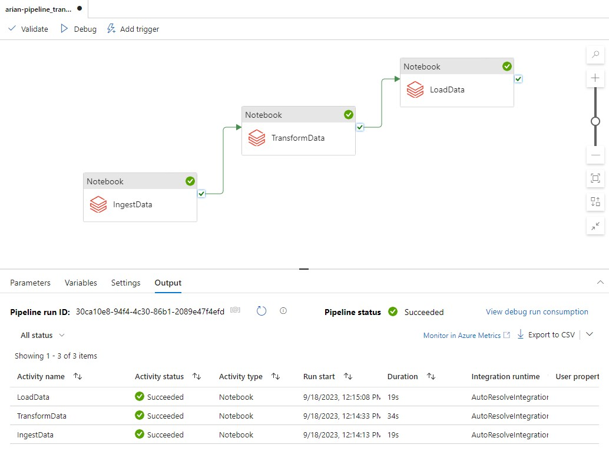

# ETL by Azure Azure Data Factory + Databricks

A pipeline for ETL (Extract, Transform, Load) processes is created using Databricks and orchestrated by Azure Data Factory workflow-based practices.
---------------------------------------------------------------------

  

Azure Data Factory is a cloud-based data integration service provided by Microsoft Azure. It enables you to create, schedule, and automate data-driven workflows for moving, transforming, and processing data from various sources to various destinations. Azure Data Factory is part of the Azure Data Integration services and plays a crucial role in modern data architectures.

